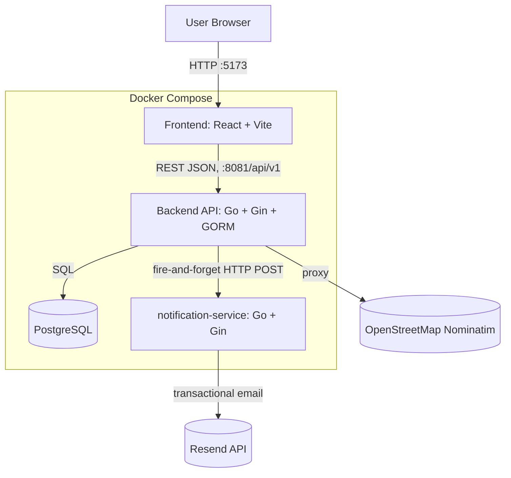
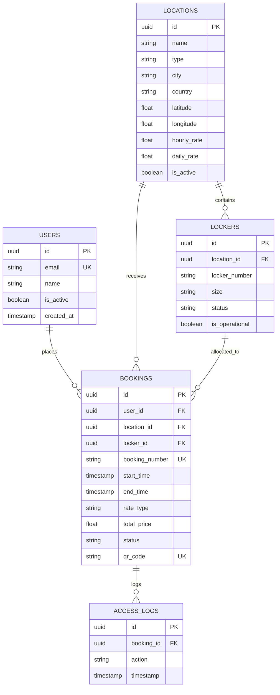
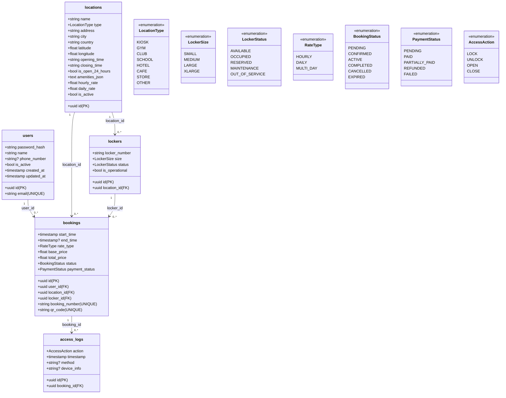
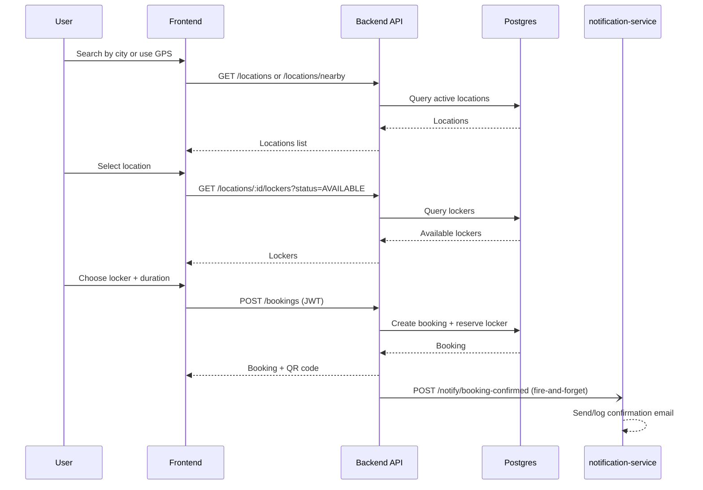
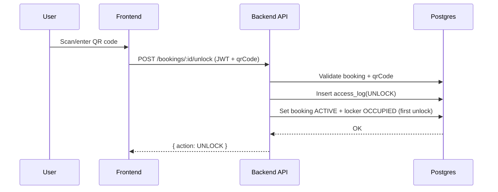
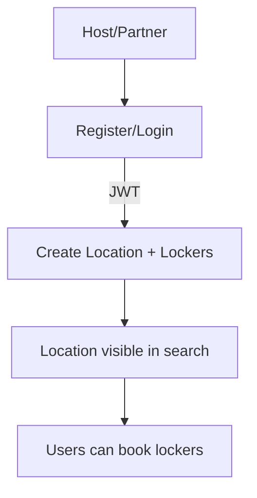

# Travel Easy — Luggage & Locker Storage Marketplace

Travel Easy is a full-stack web application that lets travelers find and book a nearby locker to safely store their luggage or belongings for a few hours or a few days — and lets local businesses (cafes, hotels, shops, gyms, stations) rent out their spare storage space as registered "kiosks." Think of it as an online booking system for physical lockers: search a city or use your GPS location, pick a storage spot, reserve a locker, and get a QR code that unlocks it in person.

It's a two-sided marketplace, conceptually similar to products like LuggageHero or Bounce:

- **Travelers** need somewhere safe and nearby to leave a bag for a few hours between checkout and a flight, during a day of sightseeing, or between meetings — without lugging it around.
- **Hosts/partners** (a cafe, a shop, a hotel front desk, a gym) have spare space they can turn into income by listing it as a storage location with a fixed number of lockers.

## The problem it solves

Anyone traveling or moving around a city with luggage runs into the same friction repeatedly:

- Hotel checkout is at 11am but the flight isn't until 9pm — where does the bag go for the day?
- A day-tripper doesn't want to carry a backpack through a museum or a hike.
- Train/airport left-luggage counters are often full, expensive, or nonexistent in smaller stations.
- Independently, small businesses with unused space (a back room, an empty locker bank, a storage closet) have no easy way to monetize that space or advertise it to travelers who need it.

Travel Easy solves both sides at once: it gives travelers a searchable, bookable network of storage points near them, and gives small businesses a lightweight way to list spare space, define locker inventory (by size), set their own hourly/daily rates, and get paid for bookings — with QR-code-based check-in/check-out so nobody needs a special app or hardware to hand over a bag.

## How it works, end to end

1. **Search.** On the home page, a traveler searches by city/place name (autocomplete backed by OpenStreetMap) or taps "use my location" to search nearby by GPS, along with a date and search radius.
2. **Browse.** Results show as a list and an interactive map of storage locations — cafes, kiosks, hotels, shops — each with its rating, hours, distance, and live count of available lockers.
3. **Pick a spot.** Opening a location shows its address, opening hours, amenities (CCTV, staffed, near transit, etc.), and hourly/daily pricing.
4. **Book.** In the booking dialog, the traveler picks a drop-off and pick-up time, how many bags, and hourly vs. daily pricing. The app finds an available locker at that location, reserves it, and creates the booking.
5. **Confirmation.** The booking is confirmed instantly with a unique booking number and a QR code. A confirmation email is sent asynchronously (or logged locally in dev) via a dedicated notification microservice.
6. **Drop off / pick up.** At the location, the traveler's QR code is scanned to unlock the locker — this is validated against the booking's time window and flips the booking to "active" and the locker to "occupied." Check-in/check-out and cancellation are also supported.
7. **Hosting.** A business that wants to list space registers/logs in, then submits its address, location type, opening hours, amenities, pricing, and how many lockers of each size (small/medium/large/extra-large) it has. The location and its locker inventory are created together, and the location immediately becomes searchable.

## Tech stack

| Layer | Technology |
|---|---|
| Frontend | React 19 + TypeScript, Vite, React Router v6, Tailwind CSS, Leaflet/react-leaflet (maps), react-day-picker |
| Backend API | Go 1.21, Gin (HTTP framework), GORM (ORM), JWT auth, bcrypt password hashing |
| Notification service | Go + Gin microservice, sends transactional email via the Resend API |
| Database | PostgreSQL 15 |
| Geocoding | OpenStreetMap Nominatim (proxied through the backend for place-name autocomplete) |
| Orchestration | Docker Compose (postgres, backend, one-shot migrate+seed, notification-service, frontend) |

## Architecture



### Runtime services & ports

| Service | In-container port | Host port |
|---|---|---|
| Frontend (Vite dev server) | 5173 | 5173 |
| Backend API | 8080 | 8081 |
| notification-service | 8090 | 8090 |
| PostgreSQL | 5432 | 5433 |

### Frontend pages

- `/` **Home** — city/place search with autocomplete, date/time picker, radius selector, "use my location," post-booking confirmation modal
- `/locations` **Locations** — search results as a list + Leaflet map; book directly from a card
- `/locations/:id` **LocationDetails** — full details for one location (hours, amenities, rating, map, "Book" CTA)
- `/bookings` **Bookings** — the logged-in user's active bookings and history
- `/profile` **Profile** — login / register / account details / logout
- `/host` **Host** — "list your space": register a new location and its locker inventory

## Quick start (Docker-first)

From the repo root:

```bash
docker compose up -d --build
```

- Frontend: http://localhost:5173
- Backend health: http://localhost:8081/health
- Backend API base: http://localhost:8081/api/v1
- notification-service health: http://localhost:8090/health
- Postgres (host): localhost:5433

`docker compose up` also runs a one-shot `backend_init` service that runs the database migrations and seeds demo data before the API starts serving traffic.

To stop:

```bash
docker compose down
```

To reset the database (drops all data):

```bash
docker compose down -v
docker compose up -d --build
```

> **Known local-dev quirk:** the `frontend` service in `docker-compose.yml` bind-mounts the repo's `node_modules` into a Linux container. If that folder was previously installed on a macOS host, Vite's `rolldown-vite` native binding will be for the wrong platform and the container will fail to start with a `Cannot find native binding` error. If that happens, just run the frontend natively on the host instead — `npm install && npm run dev` — it will talk to the already-running Dockerized backend on `localhost:8081` without any extra configuration.

## Documentation map

- This file: end-to-end architecture, API, models, flows
- [QUICK-START.md](QUICK-START.md): step-by-step run instructions (more detailed)
- [backend/README.md](backend/README.md): backend-focused notes and curl examples

## API design

### Base URL

Default (Docker):

- `http://localhost:8081/api/v1`

The frontend reads the API base from `VITE_API_URL`.

### Response envelope (all API routes)

Every API response is wrapped in a consistent envelope:

```json
{
  "success": true,
  "message": "...",
  "data": {}
}
```

Errors use:

```json
{
  "success": false,
  "error": "..."
}
```

### Authentication

- Auth uses JWT
- Protected routes require:

```http
Authorization: Bearer <token>
```

### Status codes

- `200`/`201` for success
- `400` for validation errors
- `401` for auth failures
- `404` for missing resources
- `500` for server/db failures

### Endpoints

#### Auth (public)

- `POST /auth/register`
- `POST /auth/login`

#### Profile (protected)

- `GET /profile`

#### Locations (public + protected create)

- `GET /locations` (filters: `city`, `type`)
- `GET /locations/nearby` (query: `lat`, `lon`, optional `radius` in km)
- `GET /locations/:id`
- `GET /locations/:id/lockers` (query: optional `size`, `status`, default `status=AVAILABLE` is recommended)
- `POST /locations` (protected; creates a location + locker inventory)

Note: there is currently **no role/partner approval model** — any authenticated user can call `POST /locations`.

#### Lockers (public)

- `GET /lockers/available` (query: optional `size`, `locationId`; preloads location)

#### Geocoding (public)

- `GET /geocode/suggest` (query: `q` required, `limit` optional, max 8) — proxies OpenStreetMap Nominatim so the frontend can offer place-name autocomplete without exposing a third-party API directly to the browser.

#### Bookings (protected)

- `POST /bookings` (create booking)
- `GET /bookings` (list your bookings; query: optional `status`)
- `GET /bookings/:id`
- `POST /bookings/:id/unlock` (validate QR + log access)
- `POST /bookings/:id/checkin`
- `POST /bookings/:id/checkout`
- `POST /bookings/:id/cancel`

#### notification-service (internal, port 8090)

Not part of `/api/v1` — a separate Go service the backend calls internally:

- `GET /health`
- `POST /notify/booking-confirmed` — called by the backend's `CreateBooking` handler as a fire-and-forget goroutine right after a booking is created. Renders an HTML confirmation email (booking number, location, times, bags, price, QR code) and sends it via the Resend API using `RESEND_API_KEY`/`RESEND_FROM`. If no API key is configured, it logs what it would have sent instead of failing — safe default for local development, and it never blocks or fails the booking itself.

## Key API examples

### Register

```bash
curl -sS -X POST http://localhost:8081/api/v1/auth/register \
  -H 'Content-Type: application/json' \
  -d '{
    "email": "test@example.com",
    "password": "password123",
    "name": "John Doe",
    "phoneNumber": "+4512345678"
  }'
```

### Login

```bash
curl -sS -X POST http://localhost:8081/api/v1/auth/login \
  -H 'Content-Type: application/json' \
  -d '{"email":"test@example.com","password":"password123"}'
```

### List locations (city search)

```bash
curl -sS 'http://localhost:8081/api/v1/locations?city=London'
```

### Nearby locations

```bash
curl -sS 'http://localhost:8081/api/v1/locations/nearby?lat=51.5308&lon=-0.1238&radius=10'
```

### Place autocomplete

```bash
curl -sS 'http://localhost:8081/api/v1/geocode/suggest?q=Mumbai&limit=5'
```

### Get available lockers for a location

```bash
curl -sS 'http://localhost:8081/api/v1/locations/<locationId>/lockers?status=AVAILABLE'
```

### Create booking (protected)

```bash
TOKEN='<paste token>'

curl -sS -X POST http://localhost:8081/api/v1/bookings \
  -H 'Content-Type: application/json' \
  -H "Authorization: Bearer $TOKEN" \
  -d '{
    "locationId": "<locationId>",
    "lockerId": "<lockerId>",
    "startTime": "2026-03-03T10:00:00Z",
    "duration": 4,
    "rateType": "HOURLY"
  }'
```

### Unlock locker (protected)

```bash
curl -sS -X POST http://localhost:8081/api/v1/bookings/<bookingId>/unlock \
  -H 'Content-Type: application/json' \
  -H "Authorization: Bearer $TOKEN" \
  -d '{"qrCode":"<booking.qrCode>"}'
```

### Host/partner: create location + lockers (protected)

`POST /locations` creates the location and also generates lockers (numbered `1..N`).

```bash
curl -sS -X POST http://localhost:8081/api/v1/locations \
  -H 'Content-Type: application/json' \
  -H "Authorization: Bearer $TOKEN" \
  -d '{
    "name": "King's Cross Luggage Storage",
    "type": "STORE",
    "address": "King's Cross, London",
    "city": "London",
    "country": "United Kingdom",
    "latitude": 51.5308,
    "longitude": -0.1238,
    "openingTime": "07:00",
    "closingTime": "23:00",
    "isOpen24Hours": false,
    "amenities": ["CCTV", "Near transit"],
    "hourlyRate": 5,
    "dailyRate": 20,
    "lockers": {"small": 4, "medium": 4, "large": 2, "xlarge": 1}
  }'
```

## Model design

### Entity relationships



### Database schema (UML)



### Data models (GORM)

The canonical schema is defined in [backend/internal/models/models.go](backend/internal/models/models.go) and migrated via [backend/cmd/migrate/main.go](backend/cmd/migrate/main.go).

- **User**
  - `email` unique, `password` hashed (bcrypt)
  - has many `bookings`

- **Location** — a registered storage "kiosk" (also modeled as a cafe, hotel, gym, school, club, or generic store)
  - `type`: `KIOSK | GYM | CLUB | SCHOOL | HOTEL | CAFE | STORE | OTHER`
  - geo: `latitude`, `longitude`
  - pricing: `hourlyRate`, `dailyRate`
  - `amenities` is stored as a JSON array string (e.g. `["CCTV","Staffed"]`)

- **Locker** — one physical storage unit at a location
  - belongs to `locationId`
  - `size`: `SMALL | MEDIUM | LARGE | XLARGE`
  - `status`: `AVAILABLE | RESERVED | OCCUPIED | MAINTENANCE | OUT_OF_SERVICE`

- **Booking** — a reservation of one locker for a time window
  - belongs to `userId`, `locationId`, `lockerId`
  - time: `startTime`, `endTime`
  - pricing: `rateType` + `totalPrice`
  - access: `qrCode`, and `accessLogs`
  - status: `PENDING | CONFIRMED | ACTIVE | COMPLETED | CANCELLED | EXPIRED`

- **AccessLog** — an audit trail entry for physical access to a locker
  - belongs to `bookingId`
  - action: `LOCK | UNLOCK | OPEN | CLOSE`
  - method is currently logged as `QR_SCAN` for unlock

### Pricing rules

Pricing is calculated server-side (never trust the client) — see [backend/internal/services/booking_service.go](backend/internal/services/booking_service.go):

- `HOURLY`: `ceil(hours) * hourlyRate`
- `DAILY`: `ceil(hours/24) * dailyRate`
- `MULTI_DAY`: daily pricing with a 10% discount for > 1 day

The frontend's `BookingDialog` mirrors this formula only to show a live price estimate before submitting — the server always recomputes and is the source of truth.

## Flow diagrams

### User booking flow (happy path)



### QR unlock flow



### Host onboarding flow



## Seed data (dummy locations)

On `docker compose up`, the `backend_init` service runs `./migrate && ./seed`.

The seed creates:

- Test user: `test@example.com` / `password123`
- ~20 demo locations across multiple cities (Copenhagen, Bengaluru, New Delhi, Mumbai, London, New York) with small locker inventories and a sample booking

If you update the seed code and don't see changes, rebuild and re-run init:

```bash
docker compose build backend backend_init
docker compose run --rm backend_init
```

## API contracts (request/response)

This section is a contract-style view of the REST API: required fields, types, and response shapes.

### Conventions

**Envelope** (all endpoints):

```ts
type ApiEnvelope<T> =
  | { success: true; message?: string; data: T }
  | { success: false; error: string }
```

**Auth header** (protected endpoints):

```http
Authorization: Bearer <jwt>
```

### Auth

#### POST /auth/register (public)

Request:

```ts
type RegisterRequest = {
  email: string
  password: string // min length 6
  name: string
  phoneNumber?: string
}
```

Response `data`:

```ts
type RegisterResponse = {
  user: {
    id: string
    email: string
    name: string
    phoneNumber?: string | null
    profileImageUrl?: string | null
    isActive: boolean
    createdAt: string
    updatedAt: string
  }
  token: string
}
```

#### POST /auth/login (public)

Request:

```ts
type LoginRequest = {
  email: string
  password: string
}
```

Response `data`: same shape as `RegisterResponse`.

#### GET /profile (protected)

Response `data`:

```ts
type ProfileResponse = {
  id: string
  email: string
  name: string
  phoneNumber?: string | null
  profileImageUrl?: string | null
  isActive: boolean
  createdAt: string
  updatedAt: string
}
```

### Locations

#### GET /locations (public)

Query params:

```ts
type LocationsQuery = {
  city?: string // substring match (ILIKE)
  type?: 'KIOSK' | 'GYM' | 'CLUB' | 'SCHOOL' | 'HOTEL' | 'CAFE' | 'STORE' | 'OTHER'
}
```

Response `data`:

```ts
type LocationsListResponse = {
  count: number
  locations: Location[]
}

type Location = {
  id: string
  name: string
  type: LocationsQuery['type']
  address: string
  city: string
  state?: string | null
  zipCode?: string | null
  country: string
  latitude: number
  longitude: number
  openingTime?: string
  closingTime?: string
  isOpen24Hours: boolean
  phoneNumber?: string | null
  email?: string | null
  description?: string | null
  imageUrl?: string | null
  amenities: string // JSON array string
  hourlyRate: number
  dailyRate: number
  isActive: boolean
  rating: number
  totalReviews: number
  createdAt: string
  updatedAt: string
}
```

#### GET /locations/nearby (public)

Query params:

```ts
type NearbyQuery = {
  lat: number
  lon: number
  radius?: number // km, default 10
}
```

Response `data`:

```ts
type NearbyLocationsResponse = {
  count: number
  locations: Array<Location & { distance: number; availableLockers: number }>
}
```

#### GET /locations/:id (public)

Response `data`:

```ts
type LocationDetailResponse = {
  location: Location
  availableLockers: number
}
```

#### GET /locations/:id/lockers (public)

Query params:

```ts
type LocationLockersQuery = {
  size?: 'SMALL' | 'MEDIUM' | 'LARGE' | 'XLARGE'
  status?: 'AVAILABLE' | 'OCCUPIED' | 'RESERVED' | 'MAINTENANCE' | 'OUT_OF_SERVICE' // default AVAILABLE
}
```

Response `data`:

```ts
type LockersResponse = {
  count: number
  lockers: Array<{
    id: string
    locationId: string
    lockerNumber: string
    size: LocationLockersQuery['size']
    status: LocationLockersQuery['status']
    isOperational: boolean
    createdAt?: string
    updatedAt?: string
  }>
}
```

#### POST /locations (protected)

Creates a location and generates locker inventory.

Request:

```ts
type CreateLocationRequest = {
  name: string
  type: LocationsQuery['type']
  address: string
  city: string
  state?: string
  zipCode?: string
  country: string
  latitude: number
  longitude: number
  openingTime?: string
  closingTime?: string
  isOpen24Hours?: boolean
  phoneNumber?: string
  email?: string
  description?: string
  imageUrl?: string
  amenities?: string[]
  hourlyRate?: number
  dailyRate?: number
  lockers: {
    small: number
    medium: number
    large: number
    xlarge: number
  }
}
```

Response `data`:

```ts
type CreateLocationResponse = { location: Location }
```

### Lockers

#### GET /lockers/available (public)

Query params:

```ts
type AvailableLockersQuery = {
  size?: 'SMALL' | 'MEDIUM' | 'LARGE' | 'XLARGE'
  locationId?: string
}
```

Response `data`:

```ts
type AvailableLockersResponse = {
  count: number
  lockers: Array<{
    id: string
    locationId: string
    lockerNumber: string
    size: AvailableLockersQuery['size']
    status: 'AVAILABLE'
    isOperational: boolean
    location?: Location
  }>
}
```

### Geocoding

#### GET /geocode/suggest (public)

Query params:

```ts
type GeocodeSuggestQuery = {
  q: string // required, place/city name to search
  limit?: number // optional, 1-8, default 5
}
```

Response `data`:

```ts
type GeocodeSuggestResponse = {
  count: number
  suggestions: Array<{
    lat: number
    lon: number
    title: string       // first comma-segment of the display name
    subtitle: string     // remaining comma-segments
    displayName: string  // full Nominatim display name
  }>
}
```

### Bookings

#### POST /bookings (protected)

Request:

```ts
type CreateBookingRequest = {
  locationId: string
  lockerId: string
  startTime: string // RFC3339
  duration: number // hours (can be float)
  rateType: 'HOURLY' | 'DAILY' | 'MULTI_DAY'
}
```

Response `data`:

```ts
type Booking = {
  id: string
  userId: string
  locationId: string
  lockerId: string
  bookingNumber: string
  startTime: string
  endTime?: string | null
  rateType: 'HOURLY' | 'DAILY' | 'MULTI_DAY'
  basePrice: number
  additionalCharges: number
  totalPrice: number
  status: 'PENDING' | 'CONFIRMED' | 'ACTIVE' | 'COMPLETED' | 'CANCELLED' | 'EXPIRED'
  qrCode: string
  qrCodeImageUrl?: string | null
  checkInTime?: string | null
  checkOutTime?: string | null
  paymentStatus: 'PENDING' | 'PAID' | 'PARTIALLY_PAID' | 'REFUNDED' | 'FAILED'
  paymentMethod?: string | null
  transactionId?: string | null
  notes?: string | null
  cancellationReason?: string | null
  createdAt: string
  updatedAt: string
  location?: Location
  locker?: {
    id: string
    locationId: string
    lockerNumber: string
    size: 'SMALL' | 'MEDIUM' | 'LARGE' | 'XLARGE'
    status: 'AVAILABLE' | 'OCCUPIED' | 'RESERVED' | 'MAINTENANCE' | 'OUT_OF_SERVICE'
    isOperational: boolean
  }
  accessLogs?: Array<{
    id: string
    bookingId: string
    action: 'LOCK' | 'UNLOCK' | 'OPEN' | 'CLOSE'
    timestamp: string
    method?: string | null
    deviceInfo?: string | null
  }>
}
```

#### GET /bookings (protected)

Query params:

```ts
type BookingsQuery = { status?: Booking['status'] }
```

Response `data`:

```ts
type BookingsListResponse = { count: number; bookings: Booking[] }
```

#### GET /bookings/:id (protected)

Response `data`: `Booking` (includes `accessLogs`).

#### POST /bookings/:id/unlock (protected)

Request:

```ts
type UnlockRequest = { qrCode: string }
```

Response `data`:

```ts
type UnlockResponse = { action: 'UNLOCK'; timestamp: string }
```

#### POST /bookings/:id/checkin (protected)

Response `data`:

```ts
type CheckInResponse = { checkInTime: string }
```

#### POST /bookings/:id/checkout (protected)

Response `data`:

```ts
type CheckOutResponse = { checkOutTime: string }
```

#### POST /bookings/:id/cancel (protected)

Request:

```ts
type CancelRequest = { reason?: string }
```

Response `data`: `null`.

### notification-service

#### POST /notify/booking-confirmed (internal, called by the backend only)

Request:

```ts
type BookingNotification = {
  bookingNumber: string
  userEmail: string
  userName: string
  locationName: string
  locationAddress: string
  startTime: string  // RFC3339
  endTime: string    // RFC3339
  bags: number
  rateType: 'HOURLY' | 'DAILY' | 'MULTI_DAY'
  totalPrice: number
  qrCode: string
}
```

Response: `{ "status": "sent" }` (or logs the email and still returns success if `RESEND_API_KEY` is unset).

## Environment variables

| Variable | Used by | Default | Purpose |
|---|---|---|---|
| `DATABASE_URL` | backend | (compose-provided) | Postgres connection string |
| `JWT_SECRET` | backend | `your-super-secret-jwt-key-change-in-production` | Signs/validates auth tokens — **change in production** |
| `JWT_EXPIRY` | backend | `168h` (7 days) | Token lifetime |
| `PORT` | backend / notification-service | `8080` / `8090` | Listen port |
| `GIN_MODE` | backend / notification-service | `release` | Gin logging mode |
| `CORS_ORIGIN` | backend | `http://localhost:5173` | Allowed frontend origin |
| `RESEND_API_KEY` | notification-service | *(empty)* | Resend transactional email API key; if unset, emails are logged instead of sent |
| `RESEND_FROM` | notification-service | `Travel Easy <onboarding@resend.dev>` | From-address for confirmation emails |
| `VITE_API_URL` | frontend | `http://localhost:8081/api/v1` | Base URL the frontend calls |

## Common troubleshooting

### UUID default errors

If you see errors around `gen_random_uuid()`, enable the Postgres extension:

```sql
CREATE EXTENSION IF NOT EXISTS pgcrypto;
```

### CORS

The backend allows the origin set in `CORS_ORIGIN` (default `http://localhost:5173`), plus `http://localhost:3000`. If you need a different origin, update [backend/cmd/server/main.go](backend/cmd/server/main.go).

### Frontend container fails with "Cannot find native binding"

See the Quick start note above — run `npm run dev` on the host instead of inside the `frontend` Docker service.

## Known limitations

- **No partner/role model.** Any authenticated user can call `POST /locations` and start hosting — there's no approval workflow to distinguish verified partners from regular travelers.
- **No payment integration.** `paymentStatus`/`paymentMethod`/`transactionId` exist on the `Booking` model but nothing currently drives them from a real payment provider.
- **Client-side price preview only.** The frontend recomputes the price formula for display before submitting a booking; the server is always the source of truth and recalculates independently.

## Repo structure (high level)

```
.
├── src/                       # React frontend
│   ├── pages/                 # Home, Locations, LocationDetails, Bookings, Profile, Host
│   ├── components/            # Layout, BookingDialog
│   ├── services/              # api, auth, storage (locations/lockers/bookings), geocode
│   └── types/                 # shared domain types
├── notification-service/      # Go + Gin microservice for booking confirmation emails
└── backend/                   # Go API (Gin + GORM)
    ├── cmd/                   # server / migrate / seed
    └── internal/               # handlers, models, services, middleware, utils
```
